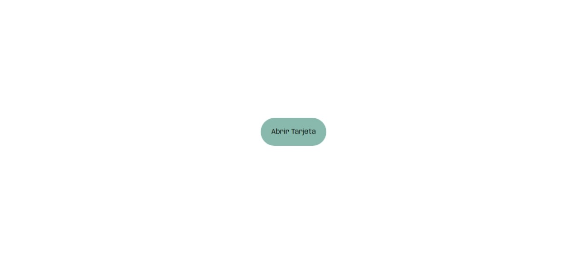
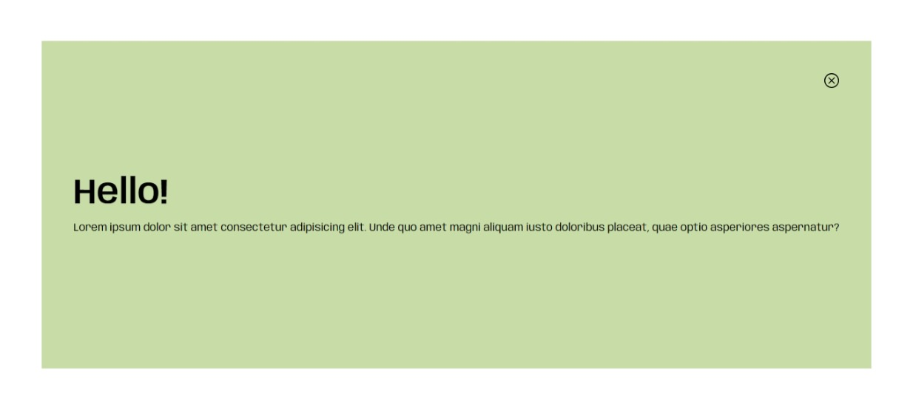

# Botón modal

### Descripción:

Práctica de modal que se puede visualizar dando click en un botón utilizando html, css y javascript.

**Vista previa del proyecto:**

**Botón estado inicial:**

**Visualización del contenido:**

### Recursos
* Fuente en [Google Fonts](https://fonts.google.com/)
* Iconos en [Bootstrap-icons](https://icons.getbootstrap.com/)
